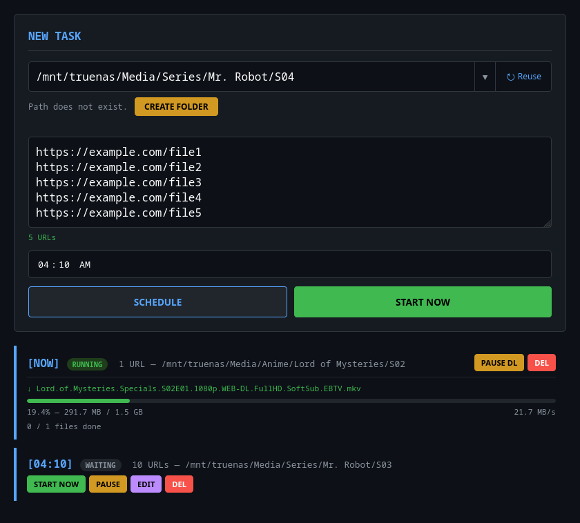

<p align="center">
  
</p>

# Aria2 Web UI

A self-contained web interface for scheduling and managing downloads with [aria2](https://aria2.github.io/).

## Features

- Schedule downloads at specific times via cron
- Start downloads immediately
- Real-time progress tracking (speed, percentage, file size)
- Pause/resume individual downloads and schedules
- Edit scheduled tasks (URLs, destination, time)
- Retry failed downloads individually or in bulk
- Path autocomplete with tab completion
- Auto path creation
- Path history across sessions
- Dark theme with responsive layout
- Tab title status indicator

## Requirements

- Python 3.8+
- aria2c (must be in PATH or accessible via `aria2c` command)
- Dependencies from `requirements.txt`

## Quick Start

```bash
pip install -r requirements.txt
python3 aria2-webui.py
```

Open http://localhost:5000 in your browser.

## Automatic Setup (recommended for non-technical users)

A single command installs everything: aria2, Python dependencies, a
configured `.env`, and a background service that survives reboots.

```bash
git clone https://github.com/afkarya/aria2-webui.git
cd aria2-webui
sudo bash setup.sh
```

The script will ask you a few questions:

- **Is an aria2 RPC server already running?** Say **yes** if you run one
  yourself (e.g. the aria2 AriaNG / Aria2-AriaNg setup); you'll be asked for
  its URL and secret. Say **no** (recommended on a fresh machine) and the app
  starts and supervises its **own built-in aria2** — no separate server needed.
- **Expose the web UI beyond this machine?** Say **yes** to reach it from
  other devices on your network, or keep the default localhost-only access.

It supports Debian/Ubuntu, Arch, Fedora and OpenWrt, installs into
`/opt/aria2-webui`, and sets up a `systemd` service (a procd init script on
OpenWrt) that auto-starts at boot. Re-run it any time to upgrade or change
settings without losing your tasks. Use `sudo bash setup.sh --uninstall` to
remove it.

## Configuration

All settings use environment variables with defaults:

| Variable | Default | Description |
|----------|---------|-------------|
| `ARIA2_RPC` | `http://localhost:6800/jsonrpc` | aria2 JSON-RPC endpoint |
| `ARIA2_SECRET` | *(empty)* | aria2 RPC secret token |
| `ARIA2_PORT` | `6800` | Port aria2c daemon listens on |
| `DB_FILE` | `aria_tasks.json` | Task persistence file |
| `DOWNLOAD_STALL_SECONDS` | `300` | Seconds before aborting stalled download |
| `CONNECTIONS_PER_SERVER` | `16` | Parallel connections/server (segmented downloads bypass per-connection speed limits) |
| `MIN_SPLIT_SIZE` | `8M` | Minimum segment size per split connection |
| `HOST` | `127.0.0.1` | Web UI listen address |
| `PORT` | `5000` | Web UI listen port |

The `ARIA2_SECRET` must match the `--rpc-secret` you set in your aria2c daemon if
you are running it separately. If left empty, the web UI will start its own aria2c
instance with an empty secret.

### Using an existing aria2c daemon

```bash
# Start your own aria2c first:
aria2c --enable-rpc --rpc-secret=mysecret --rpc-listen-port=6800 --daemon

# Then start the web UI:
ARIA2_SECRET=mysecret python3 aria2-webui.py
```

### CLI options

```
python3 aria2-webui.py --help
```

| Option | Description |
|--------|-------------|
| `--host HOST` | Listen address (overrides `HOST` env var) |
| `--port PORT` | Listen port (overrides `PORT` env var) |
| `--debug` | Enable debug logging |

## API Endpoints

| Method | Route | Description |
|--------|-------|-------------|
| GET | `/` | Web UI |
| GET | `/health` | Health check (aria2 status, task count) |
| GET/POST | `/settings` | Read/update download settings (connections/server, segment size), persisted to task DB |
| GET | `/jobs` | List all jobs with progress |
| GET | `/autocomplete?term=PATH` | Path tab-completion |
| POST | `/create_path` | Create a directory |
| POST | `/schedule` | Create a new download task |
| POST | `/edit/<job_id>` | Edit an existing task |
| POST | `/control/<action>/<job_id>` | Job control |

## License

MIT
